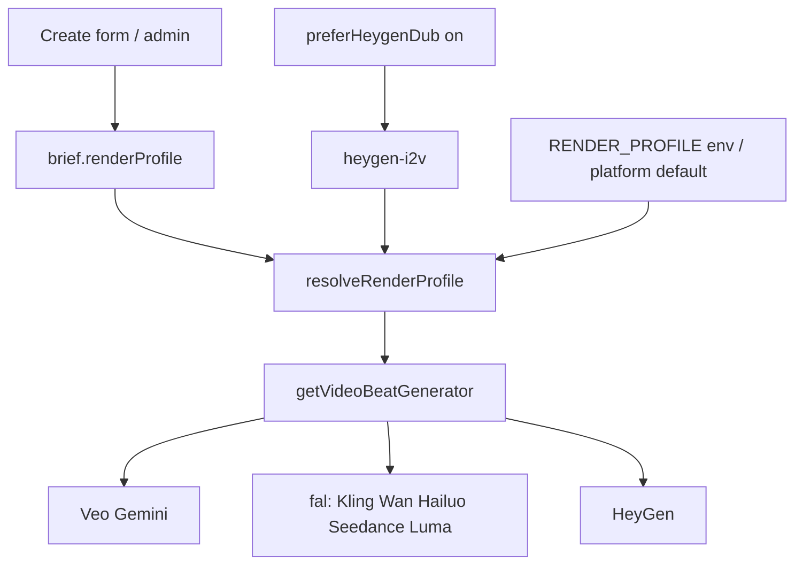

# מיפוי מודלים וספקים — Prompt2Spot / studio-agents

מקור אמת בקוד: [`packages/shared/src/renderProfiles.ts`](../packages/shared/src/renderProfiles.ts), [`packages/providers/src/gemini/common.ts`](../packages/providers/src/gemini/common.ts), [`infra/hetzner/env.example`](../infra/hetzner/env.example).

עדכון אחרון: בהתאם לפרופילי הרינדור והפייפליין הנוכחיים.

---

## 1. איך נבחר מודל וידאו לריצה

**סדר עדיפות**

1. `preferHeygenDub=on` ב־creative → כופה `heygen-i2v` (בשלב brief).
2. אחרת `brief.renderProfile` אם תקין.
3. אחרת ברירת מחדל: הגדרת פלטפורם באדמין → `RENDER_PROFILE` ב־env → `GEMINI_VEO_MODE=extend` → **`veo-multiclip`**.

**הערת טופס:** יצירת סרטון מה־UI שולחת כרגע `budgetMode: true` תמיד (פחות סצנות / מצב חסכון ל־asset).

---

## 2. פרופילי רינדור (וידאו)

| id | תווית | ספק | strategy | beat | max clip | תמונת עוגן | אודיו מהספק | מפתח / תנאי | מגבלות עיקריות |
|----|--------|-----|----------|------|----------|------------|-------------|-------------|----------------|
| `veo-multiclip` | Veo Fast — זול (ברירת מחדל) | Gemini Veo | multiclip | 4s (budget) / buckets 4–8 | 8s | לא חובה | לא (TTS בנפרד) | `GEMINI_API_KEY` | אין lip-sync אמיתי; מדיניות תוכן/סלבס; מכסות RPM/יתרה Google |
| `veo-extend` | Veo Fast — שרשרת | Gemini Veo | extend | 10s | 8s ל־API call | לא חובה | לא | `GEMINI_API_KEY` | יקר יותר; כשל באמצע השרשרת שובר את הריצה |
| `kling-i2v` | Kling 2.1 | fal | multiclip | 10s | 10s | **חובה** | לא | `FAL_API_KEY` | prompt תנועה ≤~2400 תווים; עלות לפי שנייה (~$0.09/s) |
| `wan-i2v` | Wan 2.7 | fal | multiclip | 5s | 5s | **חובה** | לא | `FAL_API_KEY` | I2V בלבד; זול יחסית |
| `hailuo-i2v` | Hailuo MiniMax | fal | multiclip | 6s | 6s | **חובה** | לא | `FAL_API_KEY` | I2V בלבד |
| `seedance-mini-i2v` | Seedance 2 Mini | fal | multiclip | 5s | 15s | **חובה** | לא | `FAL_API_KEY` | חסימות copyright; יקר יותר מ־Wan |
| `seedance-fast-i2v` | Seedance 2 Fast | fal | multiclip | 5s | 15s | **חובה** | לא | `FAL_API_KEY` | כמו למעלה, מהיר יותר / יקר יותר |
| `seedance-i2v` | Seedance 2 מלא | fal | multiclip | 5s | 15s | **חובה** | לא | `FAL_API_KEY` | איכות מלאה; יקר |
| `luma-ray-i2v` | Luma Ray 3.2 | fal | multiclip | 5s | 5s | **חובה** | לא | `FAL_API_KEY` | מקס 5s לקליפ בודד |
| `heygen-i2v` | HeyGen lip-sync | HeyGen | multiclip | 8s | 30s | **חובה** | כן (משאיר אודיו ספק) | `HEYGEN_API_KEY` (+ TTS לקלט) | קרדיטים **נפרדים** מ־Google; דורש אודיו TTS לסצנה |

**נתיבי fal (model id)**

| id | falModel |
|----|----------|
| kling-i2v | `fal-ai/kling-video/v2.1/standard/image-to-video` |
| wan-i2v | `fal-ai/wan/v2.7/image-to-video` |
| hailuo-i2v | `fal-ai/minimax/hailuo-02/standard/image-to-video` |
| seedance-mini-i2v | `bytedance/seedance-2.0/mini/image-to-video` |
| seedance-fast-i2v | `bytedance/seedance-2.0/fast/image-to-video` |
| seedance-i2v | `bytedance/seedance-2.0/image-to-video` |
| luma-ray-i2v | `luma/agent/ray/v3.2/image-to-video` |
| heygen-i2v | `heygen/v3/videos/image` (API ישיר, לא fal) |

**Veo — מודל Gemini בפועל**

נקבע מ־`GEMINI_VIDEO_MODEL` (ברירת מחדל `veo-3.1-fast-generate-preview`). אפשרויות נוספות ב־env.example: lite (לא מומלץ ל־I2V), standard (יקר).

---

## 3. מודלים שאינם וידאו (לפי שלב)

| שלב | תפקיד | מודל / ספק | env / בחירה | תנאי הפעלה | מגבלות |
|-----|--------|------------|-------------|------------|--------|
| brief | תכנון JSON | Gemini text | `GEMINI_TEXT_MODEL` ≈ `gemini-3.5-flash` | `GEMINI_API_KEY` | תלוי בשפה/creative; מצורפים בלי base64 |
| script | תסריט + veoPrompt | אותו text | כמו למעלה | אחרי brief | JSON עלול להיחתך בהרבה סצנות |
| audio | דיבוב | Gemini TTS | `GEMINI_TTS_MODEL` ≈ `gemini-2.5-flash-preview-tts` | narration לא ריק; לא muted | יידיש best-effort; `finishReason=OTHER`; ברירת קול Aoede/לפי creative |
| audio | שיבוט קול | ElevenLabs | `ELEVENLABS_API_KEY` + דגימה | העלאת `voice_clone` | בלי מפתח — שגיאה אם ביקשו שיבוט |
| audio | מוזיקה | Lyria / Gemini music | `GEMINI_MUSIC_MODEL`, `GEMINI_LYRIA_ENABLED` | budget יכול לדלג | כישלון מוזיקה לא תמיד מפיל את כל השלב |
| asset | תמונות עוגן לסצנה | Gemini image | `GEMINI_IMAGE_MODEL` ≈ `gemini-3.1-flash-image` | `GEMINI_API_KEY` | `blockReason=OTHER` / IMAGE_OTHER; עד ~2–4 refs inline; budget=`reference_only` |
| package | timeline + karaoke cues | לוגיקה מקומית | — | תמיד | אומדן זמני מילים (לא Whisper) |
| render | וידאו לפי פרופיל | ראה §2 | לפי פרופיל | credential מתאים | concat/ffmpeg; reuse קליפים |
| render | title_card / כתוביות / watermark / end card | FFmpeg | גופן מערכת | flags creative | לא API; באגי פילטרים אפשריים |

---

## 4. מפתחות env קריטיים

| משתנה | למה |
|--------|-----|
| `GEMINI_API_KEY` | brief, script, TTS, image, Veo, music |
| `RENDER_PROFILE` | ברירת מחדל גלובלית לפרופיל וידאו |
| `FAL_API_KEY` | כל פרופילי Kling / Wan / Hailuo / Seedance / Luma |
| `HEYGEN_API_KEY` | `heygen-i2v` |
| `HEYGEN_API_BASE` | ברירת מחדל `https://api.heygen.com` (ריק שובר upload) |
| `ELEVENLABS_API_KEY` | שיבוט קול בלבד |
| `GEMINI_VEO_AUDIO` | ברירת מחדל `0` — דיבוב מ־TTS + FFmpeg |
| `GCS_*` | ארטיפקטים / חתימות URL |

---

## 5. מה כל פרופיל “מצפה” מהפייפליין

| פרופיל | תסריט | אודיו | ויזואל | רינדור |
|---------|--------|--------|---------|---------|
| Veo multiclip/extend | משפטים קצרים לפי bucket | TTS לכל beat | תמונות אופציונליות | קליפים נפרדים או שרשרת extend |
| fal / Kling | motion prompt באנגלית | TTS (מעורבב ב־FFmpeg) | **reference frame חובה** | I2V לכל סצנה + concat |
| HeyGen | דיבוב מדובר קצר | **TTS חובה** (מניע שפתיים) | **תמונת דמות חובה** | lip-sync; משאיר אודיו ספק |

---

## 6. נספח — כשלים שחזרו בפרודקשן

| תסמין | ספק אמיתי | מה לעשות |
|--------|-----------|----------|
| הודעת Google Prepay + JSON `insufficient_credit` | **HeyGen** | לרכוש קרדיטים ב־HeyGen, לא ב־Google AI Studio |
| `TTS … finishReason=OTHER` | Gemini TTS | לקצר דיבוב; יידיש ללא קוד שפה `yi-*`; ניסיונות חוזרים בקוד |
| `Failed to parse URL from /v3/assets` | HeyGen base ריק | `HEYGEN_API_BASE=https://api.heygen.com` |
| `No such filter: 'drawte'` | FFmpeg title_card | פסיקים ב־`alpha=if(...)` חתכו את `drawtext` — תוקן (alpha פשוט / בלי ביטויי פסיק ב־`-vf`) |
| Kling `string_too_long` | fal Kling | קיצור veoPrompt ב־package (~2400) |
| IMAGE_OTHER / blockReason OTHER | Gemini image | retries + פרומפט רך + פחות refs |

---

## 7. המלצות בחירה מהירה

- **זול / ברירת מחדל בלי תמונה:** `veo-multiclip`
- **דיבוב עם סנכרון שפתיים:** `heygen-i2v` + תמונת דמות + יתרת HeyGen
- **תנועה מתמונה זולה:** `wan-i2v` / `hailuo-i2v` / `luma-ray-i2v`
- **איכות I2V גבוהה יותר:** `kling-i2v` או Seedance (יקר)
- **רצף ויזואלי אחד ארוך:** `veo-extend` (זהירות עלות/כשל)

---

## 8. קבצים מרכזיים לתחזוקה

- פרופילים: `packages/shared/src/renderProfiles.ts`
- בחירת generator: `packages/providers/src/video/index.ts`
- מודלי Gemini: `packages/providers/src/gemini/common.ts`
- דחיפת HeyGen מטופס: `packages/agents/brief/src/index.ts` (`preferHeygenDub`)
- env לדוגמה: `infra/hetzner/env.example`
